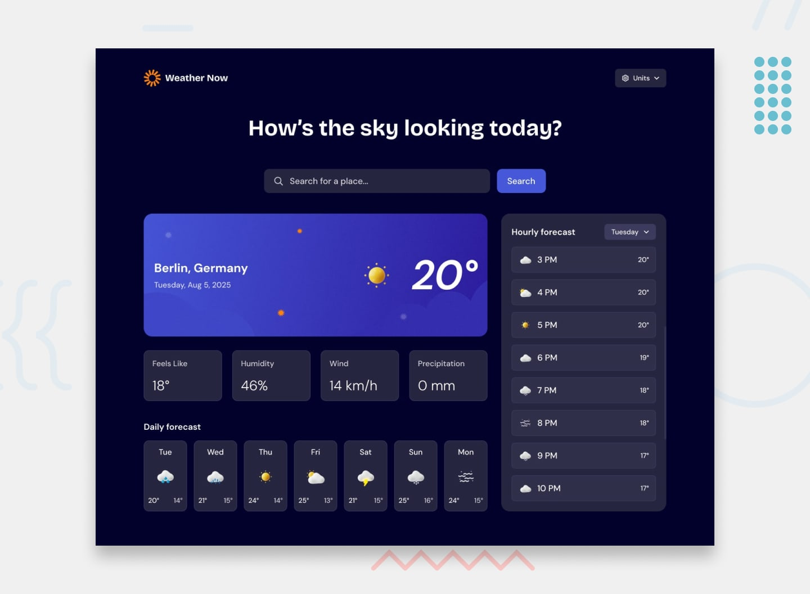

# Exercício Weather app (Frontend Mentor)

Neste exercício foi pedido para criar uma página para checar as condições do tempo de Berlin, e os botões interagem com a tela e trazem os conteúdos que foram disponibilizados. Há 1 link que altera entre demonstrações de dados temporais, em celsius e fahrenheit, há também uma barra de busca, que ao tentar buscar traz uma mensagem de não encontrado, tem também os botões dos dias da semana, que ao clicar trazem uma mensagem de erro na API.

## Sobre
Foi um exercício muito difícil para mim, levei dias, e pedi ajuda em um ponto do código. Eu realizei com meus conhecimentos até o momento adquirido no curso, eu já terminei os módulos de javascript avançado.

## Tecnologias utilizadas
- HTML
- CSS
- JS
